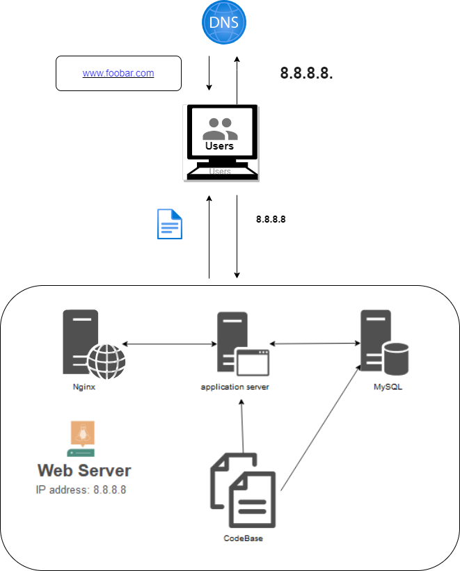

<<<<<<< HEAD
# Simple Web Stack

=======
# Simple Web Stack :

# Description :
This is a simple web infrastructure that hosts a website that can be reached through www.foobar.com. There are no firewalls or SSL certificates to protect the server's network. The resources (CPU, RAM, and SSD) provided by the server must be shared by each component (database, application server).
# Specifics About This Infrastructure :
 * What a server is.
A server is computer hardware or software that provides services to other computers, usually called clients.

* The role of the domain name.
To provide a human-friendly alias for an IP address. For example, the domain name www.wikipedia.org is easier to recognize and remember than 91.198.174.192. The IP address and the domain name alias are mapped in the Domain Name System (DNS).

* The type of DNS record www is in www.foobar.com.
www.foobar.com uses an A record. This can be verified by running dig www.foobar.com.
Note: The results may be different, but for the infrastructure in this design, an A record is used.
An Address Mapping Record (A record) - also known as a DNS host record - stores a host name and its corresponding IPv4 address.

* The role of the web server.
The Web server is a piece of software or hardware that accepts requests via HTTP or Secure HTTP (HTTPS) and responds with the content of the requested resource or with an error message.

* The Application Server Role.
Facilitates the hosting and delivery of high-end consumer or business applications by installing, operating, and hosting applications and related services for end users, IT services, and organizations.

* The role of the database.
To maintain a collection of organized information that is easy to access, easy to manage, and easy to update.

* What the server uses to communicate with the client (the computer of the user requesting the website).
The communication between the client and the server takes place over the Internet network using the TCP/IP suite of protocols.
>>>>>>> 140a08688960388933c6bdb04fc22c1dae8b33cc
