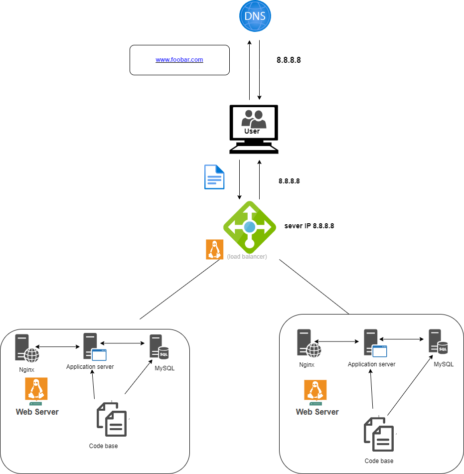

# Distributed Web Infrastructure:

link to board: https://miro.com/app/board/uXjVN-tzvvg=/?share_link_id=560637546258

# Description :
This is a distributed web infrastructure that uses a server responsible for balancing the load between the two servers (primary and replica) in an attempt to reduce traffic on the primary server by distributing some of the load to a replica server.

# Specifics About This Infrastructure:
* The distribution algorithm that the load balancer is configured to use and how it works.
The Round Robin distribution algorithm is configured on the HAProxy load balancer. This algorithm works by rotating each server behind the load balancer according to its weight. Since the processing time of the servers remains evenly distributed, it is probably the smoothest and fairest algorithm. Round Robin is a dynamic algorithm. It allows you to adjust server weights on the fly.
The setup is made possible by the load balancer.

* The HAProxy load balancer enables an Active-Passive setup instead of Active-Active. In an active-active setup, the load balancer distributes the workload across all of the nodes in order to prevent any one node from becoming overloaded. Because there are more nodes available to serve, throughput and responsiveness will improve significantly. On the other hand, in an active-passive setup, not all nodes will be active (capable of receiving workloads at any given time). If the first node is already active, the second node must be passive. The second or next passive node can become active when the first is inactive.

* How a database primary replica (master-slave) cluster operates.
A primary/replica setup configures one server as the primary server and the other server as a replica of the primary server. However, the primary server is able to perform both read and write requests, while the replica server is only able to perform read requests. The data is synchronized between the primary server and the replica server each time the primary server performs a write operation.

* The difference between the Primary Node and the Replica Node with respect to the application.
The primary node is responsible for all of the write operations that the site requires, while the replica node is capable of processing read operations, which reduces the amount of read traffic to the primary node.

# Issues With This Infrastructure :

* There are multiple SPOFs (single point failures):
	For example, if the primary MySQL database server is down, the entire site would be unable to make changes to the site (including the addition or removal of users). The load balancer server and application server connected to the primary database server are also SPOFs.
* Security issues :
	Network traffic isn't encrypted with an SSL certificate, so hackers can do network eavesdropping. There is no firewall installed on any server, so there is no way to block unauthorized IPs.
* No monitoring :
	Since the servers are not monitored, we have no way of knowing the status of each server.
