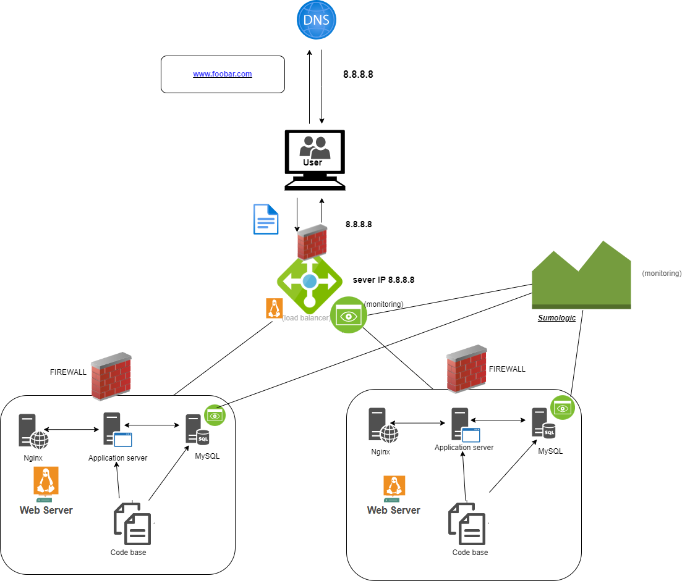

# Secured and Monitored Web Infrastructure :

# Description :

This is a 3-server web infrastructure that has security, monitoring, and traffic encryption.

# Specifics About This Infrastructure :

* How Firewalls Work.
The purpose of firewalls is to act as an intermediary between the internal network and the external network, blocking incoming traffic that meets the above criteria, thus protecting the network (at least web servers) from unwanted and unauthorized users.
* What SSL certification is used for.
To prevent man-in-the-middle (MITM) attacks and network sniffers from sniffing traffic that could expose valuable information, the SSL Certificate is used to encrypt traffic between the Web servers and the external network. The SSL certificates are a guarantee of privacy, integrity and identification.
* The purpose of the monitoring client.
The purpose of the monitoring clients is the monitoring of the servers and the external network. They analyze how the servers are performing and operating, measure overall health, and alert administrators if the servers fail to perform as expected. The monitoring tool tracks the servers and provides the administrators with key metrics about the operation of the servers. It automatically tests server accessibility, measures response time, and alerts on errors such as corrupt/missing files, security vulnerabilities/violations, and more.

# Issues With This Infrastructure : 

* Terminating SSL at the load balancer level would leave the traffic between the load balancer and the web servers unencrypted.
* Having one MySQL server is an issue because it is not scalable and can act as a single point of failure for the web infrastructure.
* Having servers with all the same components would make the components contend for resources on the server like CPU, Memory, I/O, etc., which can lead to poor performance and also make it difficult to locate the source of the problem. A setup such as this is not easily scalable.
